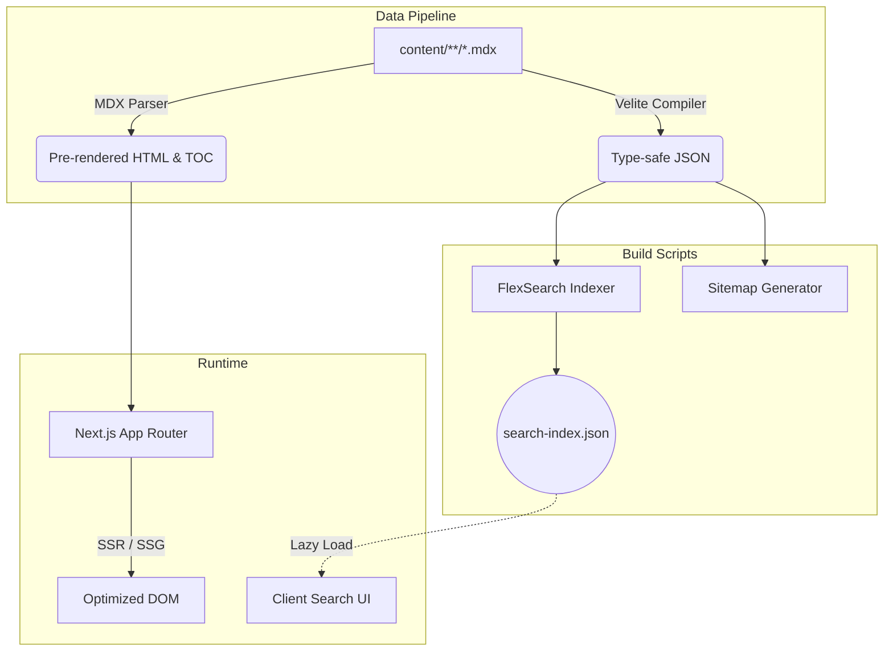

# SEQUENCE.STACK 

<p align="left">
  <a href="https://nextjs.org">
    
  </a>
  <a href="https://react.dev">
    
  </a>
  <a href="https://www.typescriptlang.org">
    
  </a>
  <a href="https://tailwindcss.com">
    
  </a>
  <a href="https://velite.js.org">
    
  </a>
</p>

> 代码即逻辑，边界即安全。

**序栈（Sequence Stack）** 是一个专注于计算机底层原理、系统安全对抗与架构演进的技术储备库。系统全面摒弃了过度工程化的渲染框架，以极简主义、硬核美学为基调，基于 **Next.js App Router** 构建了具备亚毫秒级检索、混合服务端渲染及冷感排版系统的极速文档平台。

---

## 01. CORE ARCHITECTURE

本系统采用 `Velite` 构建数据抽象树，将源文件夹下的 `MDX` 实时序列化为强类型内存对象，并交由 `Next.js` 编译器进行 Server Component 直出渲染。



---

## 02. FEATURES MATRIX

| 模块类别 | 核心技术点 | 架构实现细节 |
| :--- | :--- | :--- |
| **全文检索** | 内存级倒排索引 | 基于 `FlexSearch`，预编译纯文本提取，支持中英混合无截断分词与 120ms 防抖高亮渲染。 |
| **渲染管线** | RSC 优先 | 剥离无意义的 Client Boundary，页面骨架由 React Server Components 承担，实现零 JS 封顶。 |
| **字体排印** | 引擎抗锯齿与栅格 | 注入 `font-synthesis: style` 保护，段落行高锁定 `1.72`，最大阅读版心 `820px`。 |
| **微交互** | 物理阻尼与缓动 | 引入 `GSAP` 与 CSS 硬件加速 (`will-change`)，构建拟物玻璃卡片与边缘微光动态效果。 |
| **内容解析** | GitHub Alerts | 拓展原生 MDX，支持 `[!NOTE]` / `[!WARNING]` 等警戒块，并在服务端拦截解析为独立 UI。 |

---

## 03. DEPLOYMENT PIPELINE

系统被设计为高度解耦的状态，支持从 Serverless 到原生 Node.js 的任何主流交付协议。以下为全场景完整部署指南。

### METHOD A: PM2 守护 Node.js 运行时 (推荐)

此模式保留了最优的动态路由与 `next/image` 图片实时裁切优化功能，适合 VPS 或独立物理主机。

```bash
# 1. 依赖挂载与全量构建
pnpm install
pnpm build

# 2. 通过 PM2 编排常驻进程
pm2 start npm --name "xstack-core" -- start
```

### METHOD B: Docker 容器化编排

适用于基于 Kubernetes 或单纯 Docker-Compose 的微服务矩阵管理，环境绝对隔离。

创建 `Dockerfile`：
```dockerfile
FROM node:18-alpine AS builder
WORKDIR /app
COPY . .
RUN corepack enable pnpm && pnpm install --frozen-lockfile
RUN pnpm build

FROM node:18-alpine AS runner
WORKDIR /app
ENV NODE_ENV=production
COPY --from=builder /app/public ./public
COPY --from=builder /app/.next/standalone ./
COPY --from=builder /app/.next/static ./.next/static
EXPOSE 3000
CMD ["node", "server.js"]
```

构建与下发：
```bash
docker build -t sequence-stack:v1 .
docker run -d -p 3000:3000 --name xstack sequence-stack:v1
```

### METHOD C: 纯静态资产切片输出 (SSG)

适用于 GitHub Pages、Cloudflare Pages 等边缘节点，或完全交由 Nginx 托管静态资源。
> [!WARNING]
> 静态降级代价：此模式下所有的动态图片裁剪优化 (`next/image`) 将被关闭，返回原始尺寸图像。

```bash
# 强制触发 SSG 路由树穷举
EXPORT_STATIC=1 pnpm build
```
编译结束后，将自动生成的 `out/` 文件夹同步至目标对象存储或边缘 CDN 即可。

---

## 04. INFRASTRUCTURE & ROUTING

### NGINX 反向代理基准配置

若采用 **METHOD A / B** 部署，强烈推荐使用 Nginx 作为 SSL 卸载与反向代理网关。以下为标准的工业级防护配置：

```nginx
server {
    listen 443 ssl http2;
    server_name docs.yourdomain.com;

    # 证书挂载
    ssl_certificate     /etc/nginx/ssl/cert.pem;
    ssl_certificate_key /etc/nginx/ssl/key.pem;

    # 安全握手协议与嗅探防御
    add_header Strict-Transport-Security "max-age=31536000; includeSubDomains" always;
    add_header X-Content-Type-Options nosniff;
    add_header X-Frame-Options DENY;
    add_header X-XSS-Protection "1; mode=block";

    # GZIP 压缩策略
    gzip on;
    gzip_types text/plain text/css application/json application/javascript text/xml;

    location / {
        proxy_pass http://127.0.0.1:3000;
        proxy_http_version 1.1;
        
        # 维持 Next.js 极度依赖的 WebSocket 长连接 (HMR 与 Turbopack)
        proxy_set_header Upgrade $http_upgrade;
        proxy_set_header Connection "upgrade";
        
        # 路由拓扑透传
        proxy_set_header Host $host;
        proxy_set_header X-Real-IP $remote_addr;
        proxy_set_header X-Forwarded-For $proxy_add_x_forwarded_for;
        proxy_set_header X-Forwarded-Proto $scheme;
        proxy_cache_bypass $http_upgrade;
    }
}
```

---

## 05. DEVELOPMENT & ENVIRONMENT

<details>
<summary>展开查看开发模式与系统变量定义</summary>

### 系统运行变量表

| ENV KEY | 取值域 | 默认值 | 作用流向 |
| :--- | :--- | :--- | :--- |
| `EXPORT_STATIC` | `1` 或 `undefined` | 缺省 | 控制 Next.js 编译器是否将整个项目坍缩为纯 HTML 切片 |
| `PORT` | `1024-65535` | `3000` | 运行时对外暴露的网络端口 |
| `NODE_ENV` | `development` / `production` | `development` | 控制 React 的 Strict Mode 与各类运行时 Assert 级别 |

### 工程命令拓扑

```bash
# 安装系统依赖树
pnpm install

# 激活含有热更新 (HMR) 机制的 Turbopack 编译沙箱
pnpm dev

# 执行强类型的原子化代码审查
pnpm lint

# 启动全管线的生产资产打包
pnpm build
```

</details>

---

## 06. COMMIT PROTOCOLS

本开源分支维护者必须遵循硬核工程契约：

- **变更禁区**：禁止使用粗粒度的 `git commit -m "update"`，需明确指向作用域，如 `refactor(mdx): 重构灯箱算法`。
- **验证墙**：向 `main` 推送前必须无错误穿透 `pnpm build` 与 `pnpm lint` 审查。

> END OF FILE // V1.0.0
