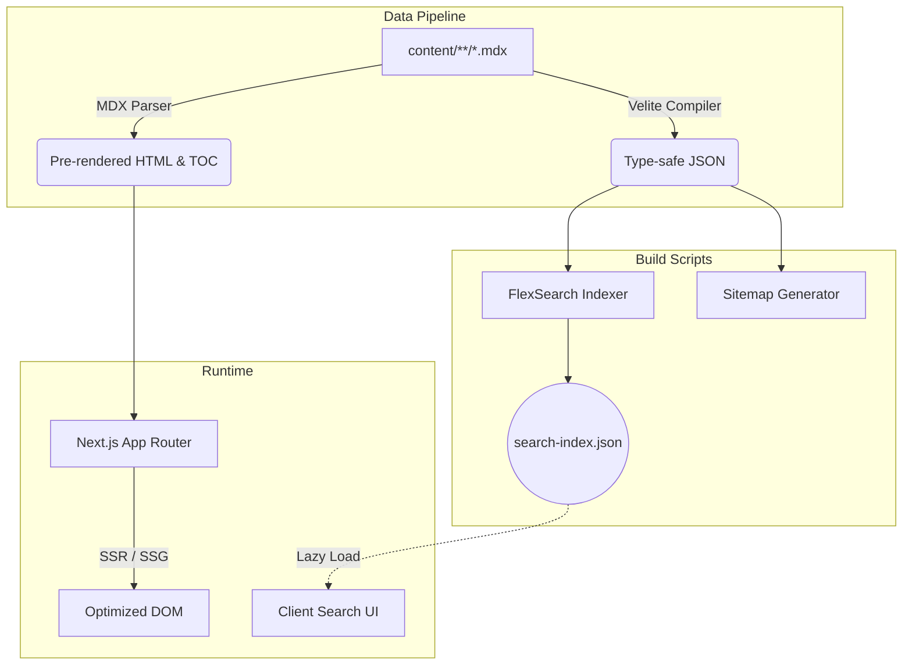

# SEQUENCE.STACK // KBASE

<p align="left">
  <a href="https://github.com/kerntau/KBase/stargazers">
    
  </a>
  <a href="https://github.com/kerntau/KBase/network/members">
    
  </a>
  <a href="https://nextjs.org">
    
  </a>
  <a href="https://react.dev">
    
  </a>
  <a href="https://tailwindcss.com">
    
  </a>
  <a href="https://github.com/kerntau/KBase/blob/main/LICENSE">
    
  </a>
</p>

> 代码即逻辑，边界即安全。

**序栈（Sequence Stack / KBase）** 是一个专注于计算机底层原理、系统安全对抗与全栈架构演进的技术极客储备库。

系统全面摒弃了过度工程化的渲染框架与花哨表象，以极简主义、硬核美学为基调，基于 **Next.js App Router** 构建了具备亚毫秒级检索、混合服务端渲染及冷感排版系统的极速文档平台。本项目不仅是一个阅读工具，更是关于如何构筑现代高性能文档站点的技术标本。

🔗 **Repository**: [https://github.com/kerntau/KBase](https://github.com/kerntau/KBase)

---

## 01. CORE ARCHITECTURE

本系统采用 `Velite` 构建抽象语法树，将源文件夹下的 `MDX` 实时序列化为强类型内存对象，并交由 `Next.js` 编译器进行 Server Component 直出渲染，杜绝传统数据库产生的 IO 延迟。



---

## 02. FEATURES MATRIX

| 领域模块 | 核心技术点 | 架构与实现细节 |
| :--- | :--- | :--- |
| **全文检索** | 内存级倒排索引 | 基于 `FlexSearch`，离线构建倒排索引树。支持中英混合无截断分词与 120ms 防抖高亮渲染，规避主线程阻塞。 |
| **渲染管线** | RSC 优先法则 | 剥离无意义的 Client Boundary，页面骨架完全由 React Server Components 承担，实现超高 Cache Hit Ratio。 |
| **字体排印** | 引擎抗锯齿与栅格 | 注入 `font-synthesis: style` 保护原生字距，段落行高锁定 `1.72`，最大阅读版心限制为 `820px`。 |
| **微交互** | 物理阻尼与缓动 | 引入 `GSAP` 与 CSS 硬件加速 (`will-change`)，构建拟物玻璃卡片 (Glassmorphism) 与边缘微光动态效果。 |
| **安全体系** | 静态资产固化 | 默认禁用所有的 `eval` 操作与未授权的外部 API 请求。通过 `MDX` 严格控制外部嵌入脚本的权限。 |

---

## 03. SYSTEM PIPELINE & DIRECTORY

从拉取源码到理解系统拓扑，请参考以下架构结构：

```text
.
├── content/                    # 数据源：MDX / Markdown 技术原稿
│   ├── backend/                # └─ 存储分布式系统、网关与微服务推演
│   ├── database/               # └─ 存储 RDBMS 原理、事务隔离分析
│   └── security/               # └─ 存储底层系统对抗、防御绕过与协议审计
│
├── scripts/                    # 流水线辅助脚本
│   └── build-search-index.js   # └─ 提取纯文本生成 FlexSearch 搜索词典
│
├── src/                        # 核心运行逻辑
│   ├── app/                    # └─ App Router 全局路由协议
│   ├── components/             # └─ 业务视图 (解耦为 /layout, /marketing, /ui)
│   ├── context/                # └─ 极简全局状态总线
│   └── lib/                    # └─ JSON-LD, Tree Node 数据组装引擎
│
├── velite.config.ts            # MDX 强类型 Schema 定义协议
└── tailwind.css                # 基于 PostCSS 的原子类系统入口
```

---

## 04. CLONE & QUICK START

如果你打算在本地拉取代码并启动研发流，请确保你的终端具备以下前置环境：
- Node.js >= 18
- pnpm >= 9 (强制推荐，禁止使用 npm/yarn 造成幽灵依赖)

```bash
# 1. 克隆代码仓库
git clone https://github.com/kerntau/KBase.git
cd KBase

# 2. 挂载依赖树
pnpm install

# 3. 激活 HMR 编译沙箱
pnpm dev
# 监听端口 http://localhost:3000
```

---

## 05. DEPLOYMENT PROTOCOLS

系统被设计为高度解耦的状态，支持从 Serverless 边缘网络到原生 Node.js 的全维度交付协议。

### METHOD A: PM2 守护 Node.js 运行时 (性能最优)
此模式保留了最佳的动态路由响应与 `next/image` 图片动态裁切能力，适合部署于独立服务器 / VPS。

```bash
# 执行生产级激进优化编译
pnpm build

# 使用 PM2 挂载常驻守护进程
pm2 start npm --name "kbase-core" -- start
```

### METHOD B: 纯静态资产切片输出 (SSG)
适用于 GitHub Pages、Vercel (无服务化)、Cloudflare Pages 或单纯交给 Nginx 托管的对象存储。
> [!WARNING]
> **静态降级代价**：此模式下服务器侧计算缺失。`next/image` 的动态裁剪压缩管线将静默失效，系统退化为输出原始尺寸的图片。

```bash
# 强制触发 SSG 穷举，输出所有路由的 HTML/CSS
EXPORT_STATIC=1 pnpm build
```
编译产物将输出至 `out/` 文件夹。

<details>
<summary>展开查看 Nginx 高反差代理网关配置示例</summary>

```nginx
server {
    listen 443 ssl http2;
    server_name docs.yourdomain.com;

    ssl_certificate     /etc/nginx/ssl/cert.pem;
    ssl_certificate_key /etc/nginx/ssl/key.pem;

    # 安全握手协议与嗅探防御
    add_header Strict-Transport-Security "max-age=31536000; includeSubDomains" always;
    add_header X-Content-Type-Options nosniff;
    add_header X-Frame-Options DENY;
    add_header X-XSS-Protection "1; mode=block";

    location / {
        proxy_pass http://127.0.0.1:3000;
        proxy_http_version 1.1;
        
        # Next.js 极度依赖 WebSocket 以进行缓存清理通信
        proxy_set_header Upgrade $http_upgrade;
        proxy_set_header Connection "upgrade";
        
        proxy_set_header Host $host;
        proxy_set_header X-Real-IP $remote_addr;
        proxy_set_header X-Forwarded-For $proxy_add_x_forwarded_for;
        proxy_set_header X-Forwarded-Proto $scheme;
    }
}
```
</details>

---

## 06. ENGINEERING & CONTRIBUTING

由于该仓库定位为严谨的技术标本，所有向该代码库提交的 PR (Pull Request) 必须无条件遵守以下硬核契约：

1. **预编译验证墙**：提交前必须能在本地无报错击穿 `pnpm build` 与 `pnpm lint` 编译。
2. **规范化 Commit**：废弃诸如 `fix bug` 或 `update` 类的劣质提交信息。严格采用 Angular 原子化提交前缀：
   ```text
   feat(search): 引入基于 FlexSearch 的防抖处理
   refactor(architecture): 重构目录拓扑并下沉业务逻辑
   ```
3. **极简原则**：拒绝任何增加无谓复杂度、非必要的外部 NPM 依赖树引入。如需添加，必须在 PR 中附带严格的性能与安全评估论证。

---

## 07. LICENSE

**Sequence.Stack / KBase** 遵循 [MIT License](https://github.com/kerntau/KBase/blob/main/LICENSE)。
你可以自由使用、修改和分发本项目的源代码，但请务必保留原作者的版权声明信息。

> SYSTEM ONLINE // EOF
