<div align="center">
  
# SEQUENCE.STACK // KBASE
  
**代码即逻辑，边界即安全。**<br>
*Code is Logic. Boundary is Security.*

<br>

[](https://github.com/kerntau/KBase/stargazers)
[](https://github.com/kerntau/KBase/network/members)
[](https://nextjs.org)
[](https://react.dev)
[](https://tailwindcss.com)
[](https://github.com/kerntau/KBase/blob/main/LICENSE)

</div>

---

## 01. THE PHILOSOPHY // 哲学与本源

**序栈（Sequence Stack）** 是一个专注于计算机底层原理、系统安全对抗与全栈架构演进的技术极客储备库。

面对充斥着黑盒化封装、沉重客户端渲染（CSR）以及过度工程化的当代软件开发，本项目试图提供一个纯粹的、高度结构化的技术知识聚落。系统本身作为一处展示技术美学的工程标本，以极严苛的标准重塑了文档渲染、状态管理、字体排印与全文检索的每一行代码。这不是一个简单的文档站，这是一场关于如何构筑现代高性能阅读体验的技术推演。

🔗 **Repository**: [https://github.com/kerntau/KBase](https://github.com/kerntau/KBase)

---

## 02. CORE ARCHITECTURE // 内核架构矩阵

本系统完全抛弃了传统的数据库动态查询模型（RDBMS/NoSQL），基于 **Next.js App Router** 构建了完全在编译期定型的极速混合型架构。

```mermaid
graph TD
    subgraph "Phase 1: Build-Time Compilation (velite)"
        A[content/**/*.mdx] -->|Schema Validation| B(Type-safe JSON Node)
        A -->|AST Parsing| C(Pre-rendered HTML & TOC)
    end
    
    subgraph "Phase 2: Index Generation"
        B --> D[FlexSearch Indexer]
        D -->|Inverted Index| E((search-index.json))
    end

    subgraph "Phase 3: Runtime Hydration (Next.js)"
        C --> G[Server Components RSC]
        G -->|Zero-JS Payload| H[Static DOM Tree]
        E -.->|Lazy Load on User Intent| I[Client Interactive Search UI]
    end
```



### 2.1 The Data Pipeline (基于 Velite 的内容管线)
- **强类型边界**：通过 Zod Schema 强制校验每篇文档的元数据（标题、日期、分类）。任何字段的缺失或类型错误将在 `pnpm build` 阶段直接触发编译中断，将运行时错误扼杀于构建期。
- **内存级读取**：运行期的所有文章数据直接通过 Node.js 内存模块导入，实现了极端的 TTFB (Time to First Byte) 延迟，规避了一切 IO 瓶颈。

---

## 03. TECHNICAL INNOVATIONS // 技术革新矩阵

| 领域模块 | 核心技术选型 | 架构实现细节深度解析 |
| :--- | :--- | :--- |
| **全量检索** | `FlexSearch` | 摒弃了沉重的 Algolia 或 Elasticsearch。在预编译阶段抽取纯文本并序列化为离线倒排索引树。客户端采取按需惰性加载与 `120ms` 级按键防抖，支持中英双语无截断分词。 |
| **渲染管线** | `RSC (React Server Components)` | 极致剥离 Client Boundary。除搜索面板、主题切换等强交互模块外，所有页面骨架均由服务端一次性直出，彻底消灭首屏白屏时间。 |
| **字体排印** | `CSS Font Synthesis Lock` | 注入 `font-synthesis: style` 保护原生字距，禁止浏览器对缺失字重的字体进行粗糙合成。段落行高锁定黄金比例 `1.72`，版心宽度严格限制为 `820px`。 |
| **微交互学** | `GSAP` & `will-change` | 引入物理阻尼计算与 CSS 硬件加速。页面加载时呈现 GPU 级别的平滑浮现；容器卡片采用 `backdrop-blur` 磨砂拟物态，悬停触发边缘极光微偏移。 |
| **降级防御** | `MDX AST Interception` | 拓展原生 Markdown 抽象语法树，在构建时拦截并注入对 GitHub Alerts (`> [!NOTE]`) 的支持，并为所有图片自动化包裹全屏灯箱 (`Lightbox`) 组件。 |

---

## 04. REPOSITORY TOPOLOGY // 源码工程拓扑

理解本系统的核心机理，从熟悉以下目录树开始：

```text
.
├── content/                    # 核心数据层：MDX / Markdown 技术原稿
│   ├── backend/                # ├─ 分布式系统、网关与微服务推演
│   ├── database/               # ├─ RDBMS 底层原理、事务隔离分析
│   ├── frontend/               # ├─ V8 引擎、渲染管线、前端安全
│   └── security/               # └─ 漏洞利用、防御绕过与内存对抗机制
│
├── scripts/                    # 编译管线附属核心组件
│   ├── build-search-index.js   # ├─ 提取所有文档纯文本，构建 FlexSearch 倒排索引
│   └── build-sitemap.js        # └─ 遍历路由树生成 XML 站点拓扑图
│
├── src/                        # 视图层与运行时逻辑
│   ├── app/                    # ├─ Next.js App Router 全局路由协议 (SSR/SSG)
│   ├── components/             # ├─ 高度解耦的业务组件树
│   │   ├── layout/             # │  ├─ 骨架级布局 (Header, Footer, WikiShell)
│   │   ├── marketing/          # │  ├─ 官网主页、发刊词等门面级展示组件
│   │   └── ui/                 # │  └─ 原子级交互组件 (Tooltip, Lightbox)
│   ├── hooks/                  # ├─ 自定义状态机 (useMounted, useScrollLock)
│   └── lib/                    # └─ 辅助引擎 (JSON-LD 注入, 抽象树遍历算法)
│
├── velite.config.ts            # 数据管线 Schema 定义协议 (Zod)
└── next.config.ts              # 核心编译策略、安全 Headers 注入与重定向规则
```

---

## 05. CLONE & QUICK START // 极速装配指南

如果你打算在本地构建该系统的运行时沙箱，请确保终端已具备以下环境：
- `Node.js >= 18`
- `pnpm >= 9` （强制要求：禁止使用 npm/yarn 以防破坏幽灵依赖锁定树）

<details open>
<summary><b>展开查看终端执行指令</b></summary>

```bash
# 1. 克隆代码仓库至本地环境
git clone https://github.com/kerntau/KBase.git
cd KBase

# 2. 挂载硬链接依赖树
pnpm install

# 3. 激活具备 HMR (热重载) 的 Turbopack 编译沙箱
pnpm dev

# 系统将启动于 http://localhost:3000
# 并在后台实时监听 content/ 目录下的 MDX 节点变更
```
</details>

---

## 06. DEPLOYMENT MATRIX // 全域部署矩阵

系统被设计为高度纯净的交付状态，支持从 Serverless 边缘网络到传统物理机的全拓扑部署。

### METHOD A: PM2 守护 Node.js 运行时 (最优性能方案)
此模式保留了最佳的动态路由响应与 `next/image` 图片动态裁切引擎，适合独立物理机或 VPS。

```bash
# 触发生产级全量激进编译
pnpm build

# 使用 PM2 挂载常驻守护进程
pm2 start npm --name "xstack-core" -- start
```

### METHOD B: Docker 容器化编排 (环境绝对隔离)
适用于基于 Kubernetes 或是单纯 Docker-Compose 的微服务矩阵管理。

<details>
<summary><b>查看标准化 Dockerfile 配置</b></summary>

```dockerfile
# 阶段 1: 构建编译
FROM node:18-alpine AS builder
WORKDIR /app
COPY . .
RUN corepack enable pnpm && pnpm install --frozen-lockfile
RUN pnpm build

# 阶段 2: 生产运行时抽离
FROM node:18-alpine AS runner
WORKDIR /app
ENV NODE_ENV=production
# 仅提取运行时必需资产
COPY --from=builder /app/public ./public
COPY --from=builder /app/.next/standalone ./
COPY --from=builder /app/.next/static ./.next/static

EXPOSE 3000
CMD ["node", "server.js"]
```
</details>

### METHOD C: 纯静态资产切片输出 (SSG 静态降级)
适用于 GitHub Pages、Vercel (无服务器化) 或是单纯交由 Nginx 托管的静态存储服务。

> [!WARNING]
> **计算降级代价**：此模式下所有的 Node 运行时计算将丢失。`next/image` 的动态裁剪压缩管线静默失效（系统退化为输出原始尺寸图片）。

```bash
# 强制触发 SSG 路由树穷举，将全站坍缩为 HTML/CSS 切片
EXPORT_STATIC=1 pnpm build
```

---

## 07. ENGINEERING CONTRACT // 工程协作契约

本仓库定位为严谨的技术实现标本，所有向该代码库发起的 PR (Pull Request) 必须无条件遵守以下硬核纪律：

1. **预编译验证墙**：提交前必须能在本地无警告击穿 `pnpm build` 与 `pnpm lint`。
2. **原子化提交 (Atomic Commits)**：废弃诸如 `fix bug` 或 `update something` 的劣质描述。严格采用 Angular 标准化前缀，并在 Body 中阐述背景与风险：
   ```text
   feat(search): 引入基于 FlexSearch 的按键防抖处理
   refactor(architecture): 重构目录拓扑并下沉业务逻辑
   docs(readme): 扩充系统架构拓扑说明矩阵
   ```
3. **极简防线**：拒绝一切增加无谓复杂度、非必要的外部 NPM 包引入。如确有必要，必须在 PR 中附带严格的体积损耗与安全审计报告。

---

## 08. ROADMAP // 系统演进路线

- [x] **V1.0 破局**：建立 RSC + Velite 数据编排核心管线。
- [x] **V1.1 检索**：实装离线构建的内存级 FlexSearch 搜索总线。
- [x] **V1.2 架构**：完成组件目录原子化拆分与 UI 阻尼动效重构。
- [ ] **V1.3 拓展**：构建对数学公式 (KaTeX) 及多语言代码高亮 (Shiki) 的深度语法解析。
- [ ] **V1.4 图谱**：引入知识节点双向链接解析（基于 Obsidian 语法树映射）。

---

## 09. LICENSE

**Sequence.Stack / KBase** 遵循 [MIT License](https://github.com/kerntau/KBase/blob/main/LICENSE) 开源协议。
你可以自由使用、修改、分发本项目的源代码以及进行商业行为，但必须保留原作者的版权声明信息。

<br>
<div align="center">
  <b>SYSTEM ONLINE // END OF FILE</b>
</div>
